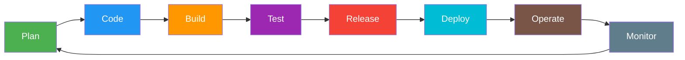
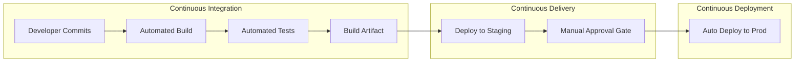
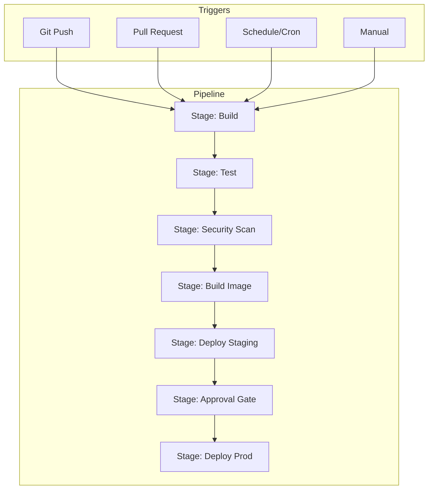
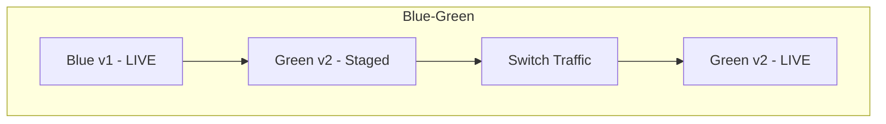
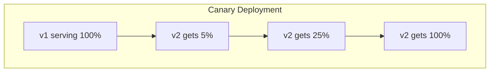
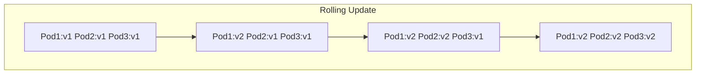
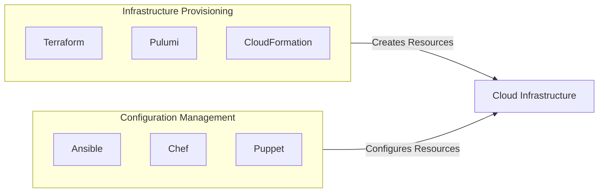
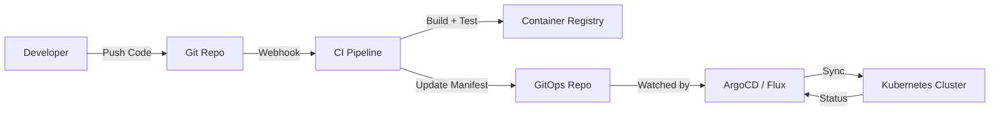

# CI/CD & DevOps Fundamentals - LEARNING MATERIAL

---

## DevOps Lifecycle

## CI vs CD vs CD

### Key Concepts

| Term | Definition |
|---|---|
| **CI** | Merge code frequently → auto build + test → catch bugs early |
| **CD (Delivery)** | Artifact always deployable, manual approval to prod |
| **CD (Deployment)** | Every passing change auto-deploys to prod |
| **Pipeline** | Automated workflow: build → test → deploy |
| **Artifact** | Output of build (Docker image, JAR, binary, package) |
| **Agent/Runner** | Machine that executes pipeline jobs |
| **Trigger** | Event that starts a pipeline (push, PR, schedule, manual) |

---

## Pipeline Architecture

---

## Deployment Strategies

### Strategy Comparison

| Strategy | Downtime | Rollback Speed | Resource Cost | Risk |
|---|---|---|---|---|
| **Blue-Green** | Zero | Instant (switch back) | 2x infrastructure | Low |
| **Canary** | Zero | Fast (route back) | 1x + small % | Very Low |
| **Rolling** | Zero | Slow (rollback pods) | 1x + surge | Medium |
| **Recreate** | Yes | Slow (redeploy) | 1x | High |

---

## DORA Metrics

| Metric | Elite | High | Medium | Low |
|---|---|---|---|---|
| **Deployment Frequency** | Multiple/day | Weekly-Monthly | Monthly-6months | >6months |
| **Lead Time for Changes** | <1 hour | 1day-1week | 1week-1month | >1month |
| **Change Failure Rate** | 0-15% | 16-30% | 16-30% | >30% |
| **MTTR** | <1 hour | <1 day | <1 week | >1 week |

---

## Infrastructure as Code (IaC)

### Declarative vs Imperative

| Approach | Description | Example |
|---|---|---|
| **Declarative** | "I want 3 servers" - system figures out how | Terraform, K8s YAML |
| **Imperative** | "Create server1, then server2, then server3" | Shell scripts, some Ansible |

---

## GitOps

### Push vs Pull Deployment

| Type | How | Tools | Pros |
|---|---|---|---|
| **Push** | CI pipeline pushes to cluster | Jenkins, Azure Pipelines | Simple, familiar |
| **Pull** | Agent in cluster pulls from Git | ArgoCD, Flux | More secure, self-healing, audit trail |
