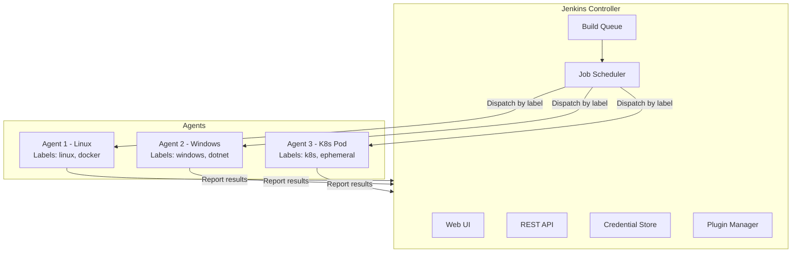
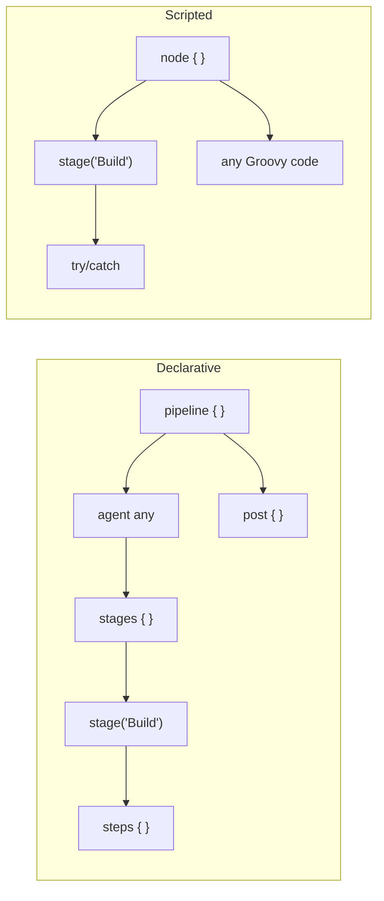

# Jenkins - LEARNING MATERIAL

---

## Jenkins Architecture



## Pipeline Types Comparison



| Feature | Declarative | Scripted |
|---|---|---|
| Syntax | Structured, opinionated | Flexible, free-form Groovy |
| Error handling | `post { failure { } }` | `try/catch/finally` |
| Validation | Built-in validation | No pre-validation |
| Flexibility | Limited by structure | Unlimited (full Groovy) |
| Learning curve | Easier | Steeper |
| Best for | Standard pipelines | Complex logic, conditionals |
| Wrapper | `pipeline { }` | `node { }` |

---

## Declarative Pipeline Structure

```groovy
pipeline {
    agent any                          // WHERE to run

    environment {                      // ENV VARS
        APP_NAME = 'myapp'
        VERSION = "${BUILD_NUMBER}"
    }

    options {                          // PIPELINE OPTIONS
        timeout(time: 30, unit: 'MINUTES')
        timestamps()
        disableConcurrentBuilds()
    }

    parameters {                       // INPUT PARAMS
        string(name: 'BRANCH', defaultValue: 'main')
        choice(name: 'ENV', choices: ['dev','staging','prod'])
        booleanParam(name: 'DEPLOY', defaultValue: true)
    }

    stages {
        stage('Build') {
            steps {
                sh 'make build'
            }
        }

        stage('Test') {
            parallel {                 // PARALLEL STAGES
                stage('Unit') {
                    steps { sh 'make unit-test' }
                }
                stage('Integration') {
                    steps { sh 'make int-test' }
                }
            }
        }

        stage('Deploy') {
            when {                     // CONDITIONAL
                branch 'main'
                expression { params.DEPLOY == true }
            }
            input {                    // APPROVAL GATE
                message "Deploy to prod?"
                ok "Yes, deploy"
            }
            steps {
                sh 'make deploy'
            }
        }
    }

    post {                             // ALWAYS RUNS
        always  { cleanWs() }
        success { echo 'Build succeeded!' }
        failure { mail to: 'team@co.com', subject: 'FAILED' }
    }
}
```

---

## Shared Libraries

```mermaid
graph TD
    subgraph SharedLib [Shared Library Git Repo]
        V[vars/]
        S[src/]
        R[resources/]
        V --> V1[buildDocker.groovy]
        V --> V2[notifySlack.groovy]
        V --> V3[standardPipeline.groovy]
        S --> S1[org/company/Utils.groovy]
    end
    subgraph Pipelines [Project Jenkinsfiles]
        P1[Project A Jenkinsfile]
        P2[Project B Jenkinsfile]
        P3[Project C Jenkinsfile]
    end
    SharedLib -->|@Library| P1
    SharedLib -->|@Library| P2
    SharedLib -->|@Library| P3
```

### vars/standardPipeline.groovy example:
```groovy
def call(Map config) {
    pipeline {
        agent any
        stages {
            stage('Build') {
                steps { sh "docker build -t ${config.imageName}:${BUILD_NUMBER} ." }
            }
            stage('Push') {
                steps { sh "docker push ${config.imageName}:${BUILD_NUMBER}" }
            }
            stage('Deploy') {
                steps { sh "kubectl set image deployment/${config.appName} app=${config.imageName}:${BUILD_NUMBER}" }
            }
        }
    }
}
```

### Usage in Jenkinsfile:
```groovy
@Library('my-shared-lib') _
standardPipeline(imageName: 'myregistry/myapp', appName: 'myapp')
```

---

## Jenkins Credential Types

| Type | Use Case | Pipeline Usage |
|---|---|---|
| Username/Password | Registry login, API auth | `usernamePassword(credentialsId: 'id', usernameVariable: 'U', passwordVariable: 'P')` |
| Secret Text | API tokens, simple secrets | `string(credentialsId: 'id', variable: 'TOKEN')` |
| SSH Key | Git clone, server access | `sshUserPrivateKey(credentialsId: 'id', keyFileVariable: 'KEY')` |
| Secret File | Kubeconfig, certs | `file(credentialsId: 'id', variable: 'FILE')` |
| Certificate | Client certificates | `certificate(credentialsId: 'id', ...)` |

---

## Scripted Pipeline Basics

```groovy
node('linux') {
    try {
        stage('Checkout') {
            checkout scm
        }
        stage('Build') {
            sh 'make build'
        }
        stage('Test') {
            sh 'make test'
        }
        stage('Deploy') {
            if (env.BRANCH_NAME == 'main') {
                input 'Deploy to production?'
                sh 'make deploy'
            }
        }
    } catch (e) {
        currentBuild.result = 'FAILURE'
        mail to: 'team@co.com', subject: "FAILED: ${env.JOB_NAME}"
        throw e
    } finally {
        cleanWs()
    }
}
```

---

## Jenkins Agent Types

```mermaid
graph TD
    Controller[Jenkins Controller] --> P[Permanent Agent<br/>Always connected<br/>SSH / JNLP]
    Controller --> C[Cloud Agent<br/>On-demand<br/>Docker / K8s / EC2]
    Controller --> D[Docker Agent<br/>per pipeline { agent { docker 'image' } }]
    P --> P1[Good for: specialized hardware, licensed tools]
    C --> C1[Good for: scalability, cost, clean environments]
    D --> D1[Good for: reproducible builds, isolation]
```
