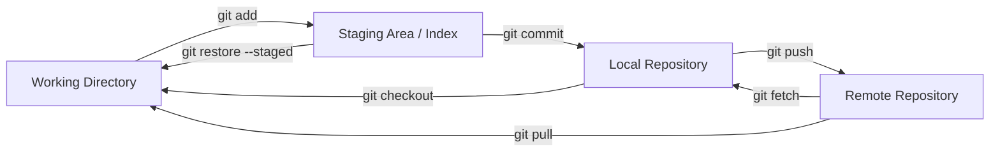
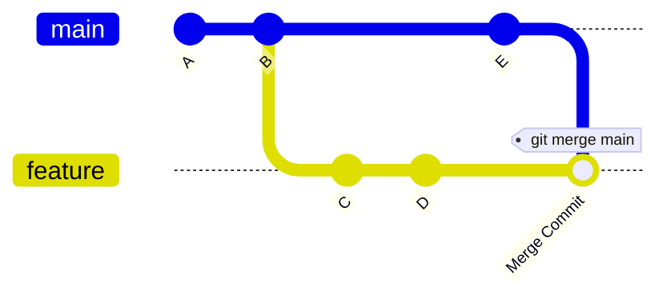
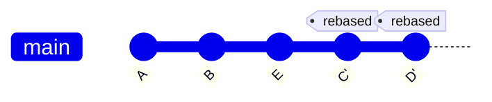
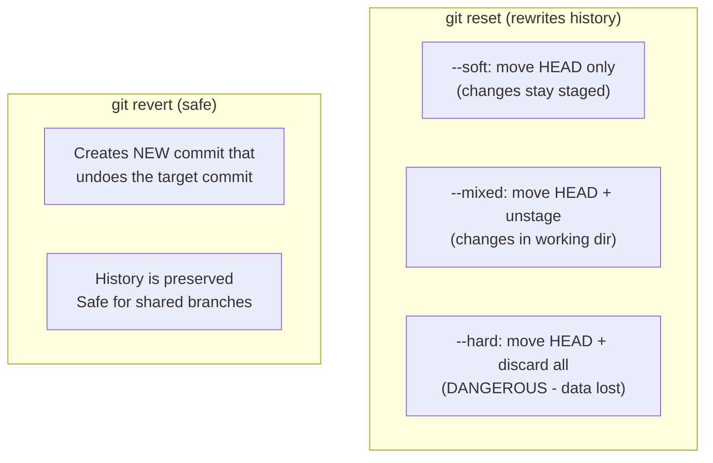
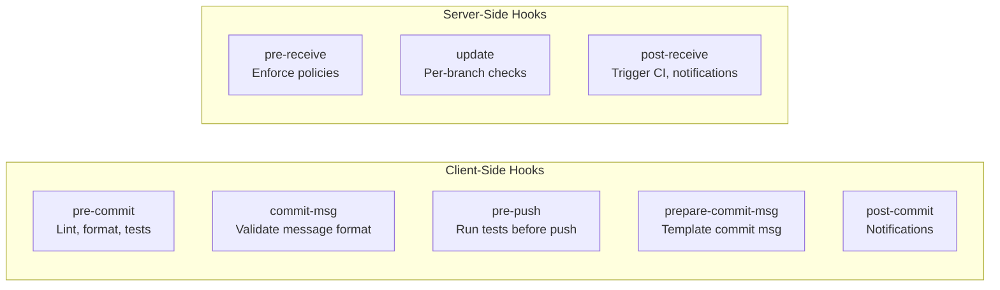
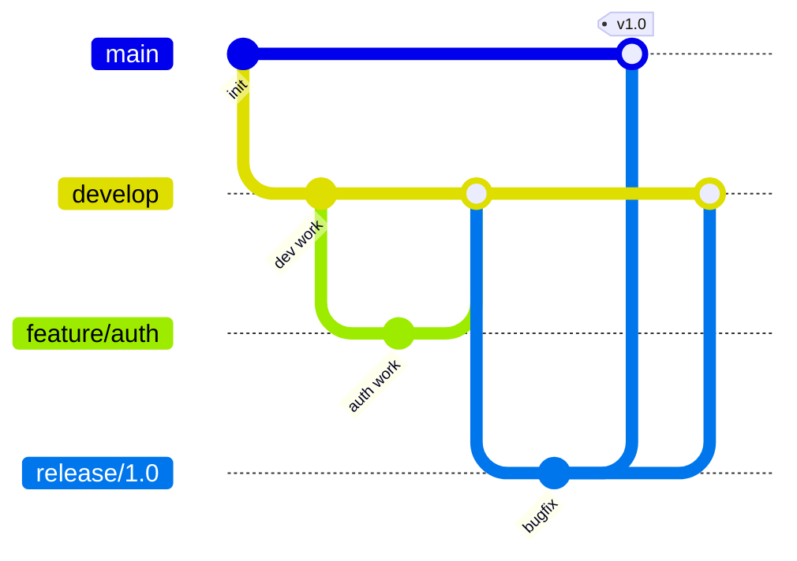
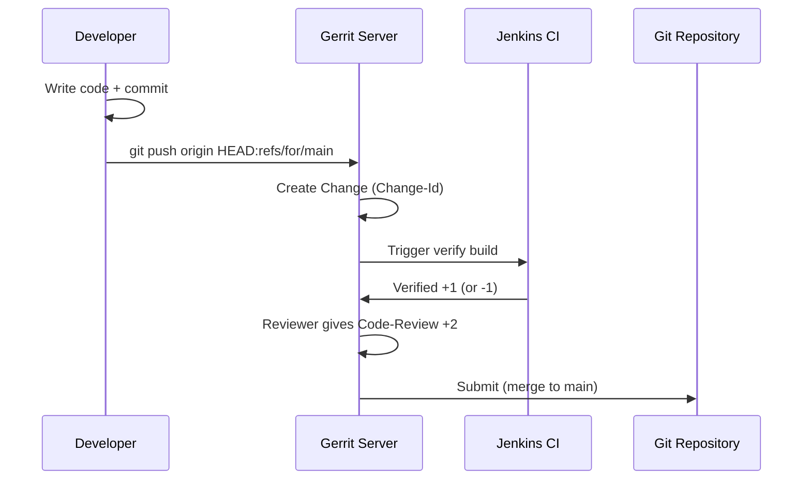
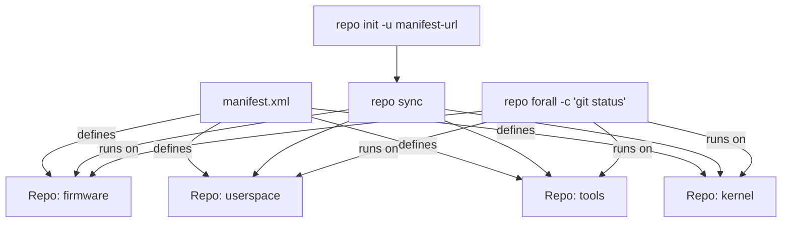

# Git - LEARNING MATERIAL

---

## Git Three States



## Merge vs Rebase





### Merge: Creates merge commit, preserves history (non-linear)
### Rebase: Replays commits on top, creates linear history (rewrites hashes)

---

## Git Advanced Operations Cheat Sheet

### Cherry-Pick
```bash
# Apply specific commit to current branch
git cherry-pick abc123

# Cherry-pick without auto-committing
git cherry-pick --no-commit abc123

# Cherry-pick range
git cherry-pick A..B    # commits after A up to B
git cherry-pick A^..B   # commits from A to B inclusive
```

### Bisect
```bash
git bisect start
git bisect bad                  # current is broken
git bisect good v1.0            # v1.0 was working
# Git checks out middle commit → you test → mark good/bad
git bisect good    # or git bisect bad
# Repeat until culprit found
git bisect reset                # return to original state

# Automated bisect
git bisect start HEAD v1.0
git bisect run ./test.sh        # auto-runs script on each commit
```

### Stash
```bash
git stash                       # save all changes
git stash save "message"        # with description
git stash -u                    # include untracked files
git stash list                  # see all stashes
git stash show stash@{0}        # see diff
git stash pop                   # apply latest + remove
git stash apply stash@{2}       # apply specific, keep in list
git stash drop stash@{0}        # delete specific
git stash clear                 # delete all
git stash branch new-branch     # create branch from stash
```

### Reset vs Revert


### Reflog
```bash
git reflog                      # show all HEAD movements
git reflog show feature-branch  # specific branch history
git checkout HEAD@{5}           # go back 5 moves
git branch recovery HEAD@{5}    # save recovered commit
```

---

## Git Hooks



---

## Branching Strategies


**GitFlow**: main + develop + feature/* + release/* + hotfix/*. Best for scheduled releases.

**Trunk-Based**: Everyone works on main. Short-lived branches (<1 day). Feature flags for incomplete work. Best for continuous deployment.

**GitHub Flow**: main + feature branches + PRs. Simple. Good for web apps.

---

## Gerrit Workflow



### Gerrit vs GitHub PR

| Aspect | Gerrit | GitHub PR |
|---|---|---|
| Unit of review | Single commit | Branch (multiple commits) |
| Update mechanism | Amend commit (same Change-Id) | Push new commits |
| Scoring | +1/+2 for approve, -1/-2 for reject | Approve/Request Changes |
| Merge style | Rebase preferred | Merge/Squash/Rebase options |
| Push target | `refs/for/<branch>` | Regular branch + create PR |

---

## Google Repo


