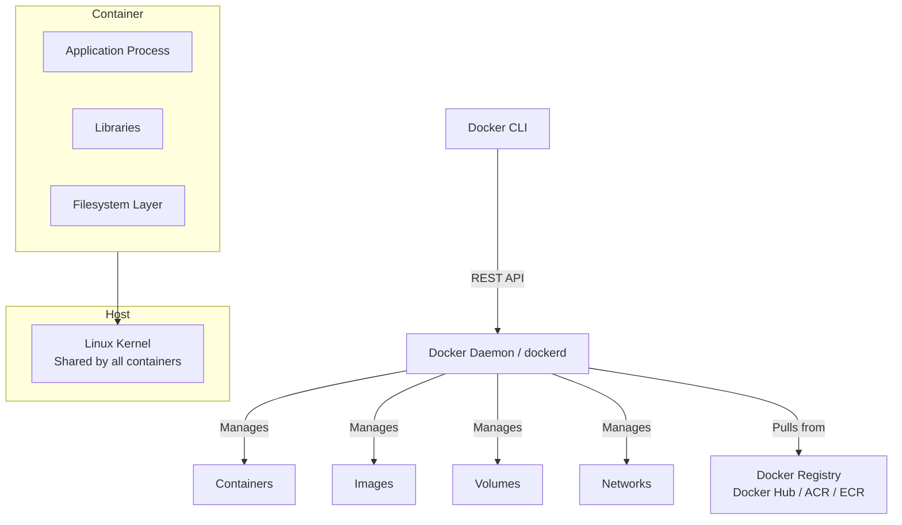
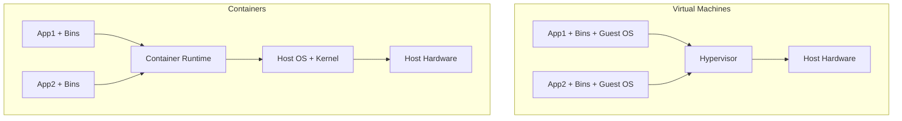
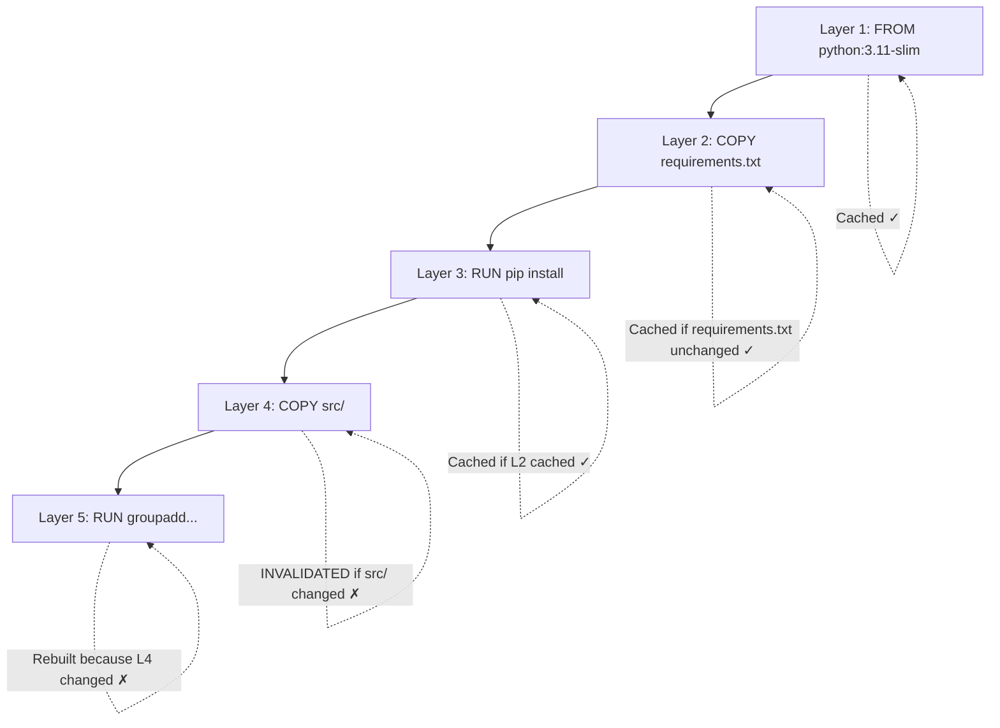
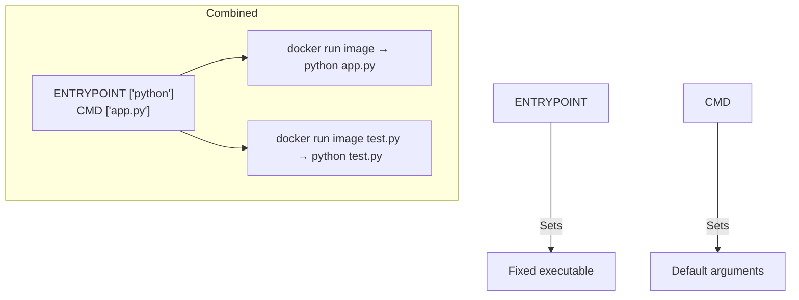
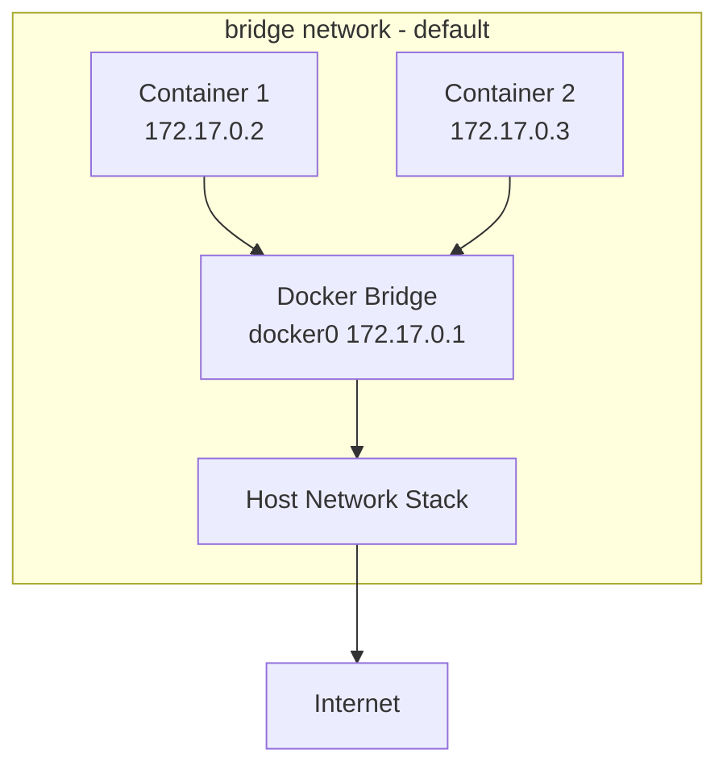

# Docker - LEARNING MATERIAL

---

## Docker Architecture



## Container vs VM



| Aspect | Container | VM |
|---|---|---|
| Size | MBs | GBs |
| Start time | Seconds | Minutes |
| Isolation | Process-level | Full OS |
| Overhead | Low | High |
| Portability | High | Medium |

---

## Dockerfile Instructions

```dockerfile
# COMPLETE REFERENCE DOCKERFILE
FROM python:3.11-slim AS builder    # Base image + stage name
LABEL maintainer="vaibhav@example.com"  # Metadata

ARG APP_VERSION=1.0                 # Build-time variable
ENV APP_ENV=production              # Runtime env variable
ENV PORT=8080

WORKDIR /app                        # Set working directory

# Dependencies first (layer caching!)
COPY requirements.txt .
RUN pip install --no-cache-dir -r requirements.txt

# Source code (changes frequently → after deps)
COPY src/ ./src/

# Security: non-root user
RUN groupadd -r appuser && useradd -r -g appuser appuser
USER appuser

EXPOSE ${PORT}                      # Document port

HEALTHCHECK --interval=30s --timeout=5s --retries=3 \
    CMD curl -f http://localhost:${PORT}/health || exit 1

ENTRYPOINT ["python"]              # Fixed executable
CMD ["src/main.py"]                # Default arguments
```

## Docker Layer Caching



**Rule**: Order instructions from **least** to **most** frequently changing.

---

## ENTRYPOINT vs CMD



| Scenario | ENTRYPOINT | CMD | docker run result |
|---|---|---|---|
| CMD only | — | `["python", "app.py"]` | `python app.py` |
| ENTRYPOINT only | `["python"]` | — | `python` |
| Both | `["python"]` | `["app.py"]` | `python app.py` |
| Override CMD | `["python"]` | `["app.py"]` | `docker run img test.py` → `python test.py` |

---

## Docker Networking



| Network Mode | Description | Use Case |
|---|---|---|
| `bridge` | Default. Containers get private IPs. | Most applications |
| `host` | Container shares host's network stack | Performance-critical |
| `none` | No networking | Security isolation |
| `overlay` | Multi-host networking | Docker Swarm / K8s |
| `macvlan` | Container gets own MAC/IP on physical network | Legacy apps |

---

## Docker Security Best Practices

1. Run as non-root user (`USER 1001`)
2. Use specific image tags, not `latest`
3. Use slim/distroless/alpine base images
4. Scan images (Trivy, Snyk)
5. Don't store secrets in images
6. Use `.dockerignore`
7. Set read-only filesystem where possible
8. Drop capabilities (`--cap-drop ALL`)
9. Use multi-stage builds (no build tools in prod)
10. Set resource limits (`--memory`, `--cpus`)
