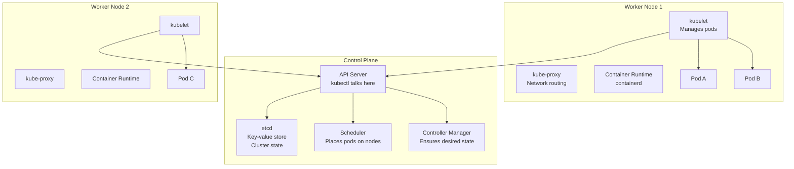
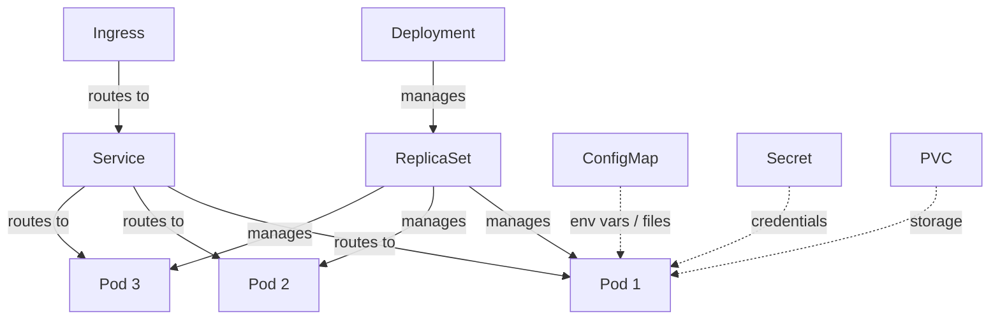
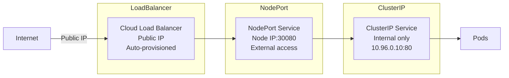
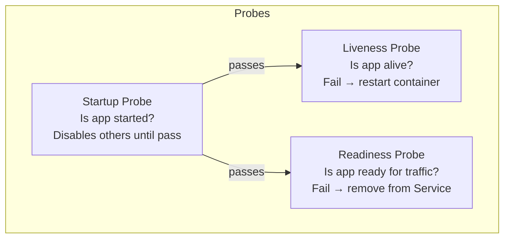
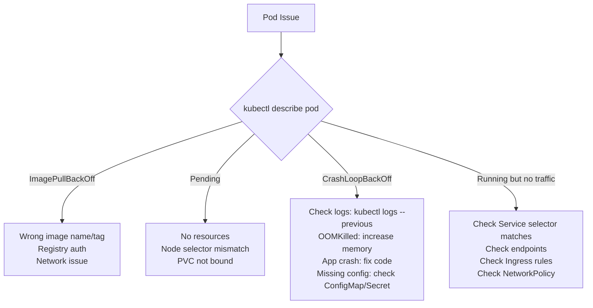

# Kubernetes - LEARNING MATERIAL

---

## K8s Architecture



## K8s Object Hierarchy



## Service Types



| Type | Access | Port | Use Case |
|---|---|---|---|
| `ClusterIP` | Internal only | Any | Default, inter-service |
| `NodePort` | External via node IP | 30000-32767 | Dev/test |
| `LoadBalancer` | External via cloud LB | Any | Production |
| `ExternalName` | DNS CNAME | N/A | External service alias |

## Probes



## Complete Manifest Template

```yaml
# deployment.yaml
apiVersion: apps/v1
kind: Deployment
metadata:
  name: myapp
  namespace: production
  labels:
    app: myapp
spec:
  replicas: 3
  selector:
    matchLabels:
      app: myapp
  strategy:
    type: RollingUpdate
    rollingUpdate:
      maxSurge: 1          # 1 extra pod during update
      maxUnavailable: 0    # never have fewer than 3
  template:
    metadata:
      labels:
        app: myapp
    spec:
      containers:
      - name: myapp
        image: registry/myapp:v1.2.3
        ports:
        - containerPort: 8080
        env:
        - name: DB_HOST
          valueFrom:
            configMapKeyRef:
              name: myapp-config
              key: db_host
        - name: DB_PASS
          valueFrom:
            secretKeyRef:
              name: myapp-secret
              key: password
        resources:
          requests:
            cpu: 100m
            memory: 128Mi
          limits:
            cpu: 500m
            memory: 512Mi
        startupProbe:
          httpGet:
            path: /healthz
            port: 8080
          failureThreshold: 30
          periodSeconds: 10
        livenessProbe:
          httpGet:
            path: /healthz
            port: 8080
          periodSeconds: 10
        readinessProbe:
          httpGet:
            path: /ready
            port: 8080
          periodSeconds: 5
---
apiVersion: v1
kind: Service
metadata:
  name: myapp-svc
spec:
  type: ClusterIP
  selector:
    app: myapp
  ports:
  - port: 80
    targetPort: 8080
---
apiVersion: v1
kind: ConfigMap
metadata:
  name: myapp-config
data:
  db_host: "postgres.prod.svc.cluster.local"
---
apiVersion: v1
kind: Secret
metadata:
  name: myapp-secret
type: Opaque
data:
  password: cGFzc3dvcmQ=    # base64
---
apiVersion: networking.k8s.io/v1
kind: Ingress
metadata:
  name: myapp-ingress
  annotations:
    nginx.ingress.kubernetes.io/rewrite-target: /
spec:
  ingressClassName: nginx
  tls:
  - hosts:
    - app.example.com
    secretName: tls-secret
  rules:
  - host: app.example.com
    http:
      paths:
      - path: /
        pathType: Prefix
        backend:
          service:
            name: myapp-svc
            port:
              number: 80
```

## Troubleshooting Flow



## Helm Chart Structure
```
mychart/
├── Chart.yaml          # Chart metadata (name, version)
├── values.yaml         # Default values
├── templates/
│   ├── deployment.yaml # {{ .Values.replicas }}
│   ├── service.yaml
│   ├── ingress.yaml
│   ├── configmap.yaml
│   ├── _helpers.tpl    # Template helpers
│   └── NOTES.txt       # Post-install message
└── charts/             # Sub-chart dependencies
```
