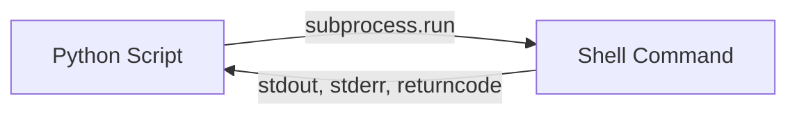

# Python - LEARNING MATERIAL

---

## Python Basics Refresher

### Data Types & Structures
```python
# Strings
name = "Vaibhav"
f_string = f"Hello, {name}!"
multiline = """Line 1
Line 2"""

# Lists (mutable, ordered)
fruits = ["apple", "banana", "cherry"]
fruits.append("date")
fruits[0]          # "apple"
fruits[-1]         # "date"
sliced = fruits[1:3]  # ["banana", "cherry"]

# Tuples (immutable)
point = (10, 20)

# Dictionaries
config = {"host": "localhost", "port": 8080}
config["host"]
config.get("timeout", 30)  # default if missing

# Sets (unique values)
tags = {"python", "devops", "ci"}
```

### Control Flow
```python
# If/elif/else
if status == 200:
    print("OK")
elif status == 404:
    print("Not Found")
else:
    print(f"Error: {status}")

# For loops
for item in fruits:
    print(item)
for i, item in enumerate(fruits):
    print(f"{i}: {item}")
for key, value in config.items():
    print(f"{key}={value}")

# List comprehension
squares = [x**2 for x in range(10)]
evens = [x for x in range(20) if x % 2 == 0]

# Dict comprehension
env_upper = {k.upper(): v for k, v in config.items()}
```

### Functions
```python
def deploy(env: str, version: str = "latest", dry_run: bool = False) -> bool:
    """Deploy application to specified environment."""
    if dry_run:
        print(f"Would deploy {version} to {env}")
        return True
    # actual deploy logic
    return True

# Lambda
sort_by_age = sorted(users, key=lambda u: u["age"])

# *args and **kwargs
def log_event(*args, **kwargs):
    print(f"Args: {args}, Kwargs: {kwargs}")
```

## File Operations
```python
# Read file
with open("config.yaml", "r") as f:
    content = f.read()

# Write file
with open("output.txt", "w") as f:
    f.write("Hello World\n")

# Read lines
with open("hosts.txt") as f:
    hosts = [line.strip() for line in f if line.strip()]

# JSON
import json
data = json.loads('{"name": "app"}')
json_str = json.dumps(data, indent=2)
with open("data.json") as f:
    data = json.load(f)

# YAML
import yaml
with open("config.yaml") as f:
    config = yaml.safe_load(f)
```

## subprocess Module (CRITICAL for DevOps)



```python
import subprocess

# Basic command
result = subprocess.run(["ls", "-la"], capture_output=True, text=True)
print(result.stdout)
print(result.returncode)  # 0 = success

# With error handling
result = subprocess.run(
    ["kubectl", "get", "pods", "-n", "prod"],
    capture_output=True, text=True, timeout=30
)
if result.returncode != 0:
    print(f"Error: {result.stderr}")

# Shell mode (use carefully - shell injection risk!)
result = subprocess.run(
    "ps aux | grep python",
    shell=True, capture_output=True, text=True
)

# check=True raises exception on non-zero exit
try:
    subprocess.run(["docker", "build", "."], check=True)
except subprocess.CalledProcessError as e:
    print(f"Build failed: {e}")
```

## os Module
```python
import os

os.environ["PATH"]                   # Get env var
os.environ.get("API_KEY", "default") # With default
os.getcwd()                          # Current directory
os.chdir("/tmp")                     # Change directory
os.path.exists("/etc/config")        # Check exists
os.path.join("dir", "file.txt")      # Path joining
os.makedirs("a/b/c", exist_ok=True)  # Create dirs
os.listdir(".")                      # List directory
os.remove("file.txt")               # Delete file

# Walk directory tree
for root, dirs, files in os.walk("/var/log"):
    for f in files:
        print(os.path.join(root, f))
```

## REST APIs with requests
```python
import requests

# GET
resp = requests.get("https://api.github.com/repos/python/cpython")
resp.raise_for_status()  # Raise on 4xx/5xx
data = resp.json()

# POST with auth
resp = requests.post(
    "https://api.example.com/deploy",
    json={"env": "prod", "version": "1.2.3"},
    headers={"Authorization": f"Bearer {token}"},
    timeout=30
)

# Error handling pattern
try:
    resp = requests.get(url, timeout=10)
    resp.raise_for_status()
    return resp.json()
except requests.ConnectionError:
    print("Cannot connect")
except requests.Timeout:
    print("Request timed out")
except requests.HTTPError as e:
    print(f"HTTP error: {e.response.status_code}")
```

## Classes (OOP Basics)
```python
class Pipeline:
    def __init__(self, name: str, stages: list = None):
        self.name = name
        self.stages = stages or []
        self.status = "pending"

    def add_stage(self, stage: str):
        self.stages.append(stage)

    def run(self) -> bool:
        self.status = "running"
        for stage in self.stages:
            print(f"Running {stage}...")
        self.status = "completed"
        return True

    def __str__(self):
        return f"Pipeline({self.name}, {len(self.stages)} stages)"

# Inheritance
class CIPipeline(Pipeline):
    def __init__(self, name, repo_url):
        super().__init__(name)
        self.repo_url = repo_url

    def run(self):
        print(f"Cloning {self.repo_url}")
        return super().run()
```

## Exception Handling
```python
try:
    result = risky_operation()
except FileNotFoundError:
    print("File not found")
except (ValueError, TypeError) as e:
    print(f"Bad value: {e}")
except Exception as e:
    print(f"Unexpected: {e}")
    raise  # re-raise
else:
    print("Success!")  # runs if no exception
finally:
    cleanup()  # always runs
```
