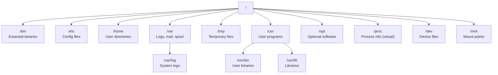
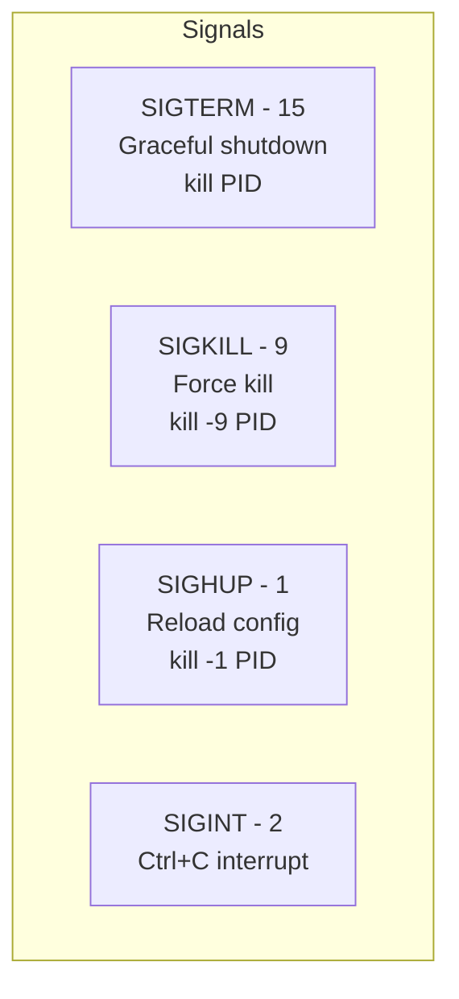
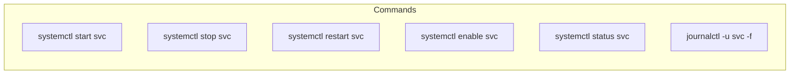

# Linux - LEARNING MATERIAL (YOUR CRITICAL GAP)

---

## Linux File System Hierarchy



---

## File Permissions

```
-rwxr-xr--  1  user  group  4096  May 24 10:00  file.txt
│├─┤├─┤├─┤
│ │   │  │
│ │   │  └── Others: r-- (4) read only
│ │   └───── Group:  r-x (5) read + execute
│ └───────── Owner:  rwx (7) read + write + execute
└─────────── Type:   - (file), d (dir), l (link)
```

| Octal | Permission | Meaning |
|---|---|---|
| 7 | rwx | Read + Write + Execute |
| 6 | rw- | Read + Write |
| 5 | r-x | Read + Execute |
| 4 | r-- | Read only |
| 3 | -wx | Write + Execute |
| 2 | -w- | Write only |
| 1 | --x | Execute only |
| 0 | --- | None |

`chmod 755` = Owner: rwx, Group: r-x, Others: r-x

---

## grep / awk / sed Cheat Sheet

### grep — Search patterns in files
```bash
grep "pattern" file              # basic search
grep -i "pattern" file           # case-insensitive
grep -r "pattern" ./dir/         # recursive in directory
grep -n "pattern" file           # show line numbers
grep -c "pattern" file           # count matches
grep -v "pattern" file           # invert (exclude matches)
grep -l "pattern" *.log          # list filenames only
grep -E "pat1|pat2" file         # extended regex (OR)
grep -A3 -B3 "error" file       # 3 lines After and Before
grep --include="*.py" -r "TODO"  # search specific file types
```

### awk — Column-based text processing
```bash
# Print specific columns (space-separated by default)
awk '{print $1, $3}' file

# Custom delimiter
awk -F: '{print $1, $7}' /etc/passwd    # colon-separated

# Conditional
awk '$3 > 100 {print $1, $3}' file      # if column 3 > 100

# Sum a column
awk '{sum += $3} END {print sum}' file

# Count lines matching pattern
awk '/ERROR/ {count++} END {print count}' file

# Format output
awk '{printf "%-20s %10d\n", $1, $3}' file

# Multiple conditions
awk '$1 == "GET" && $9 >= 500 {print}' access.log
```

### sed — Stream editor (find & replace)
```bash
# Replace first occurrence per line
sed 's/old/new/' file

# Replace ALL occurrences
sed 's/old/new/g' file

# In-place edit
sed -i 's/old/new/g' file

# Delete lines matching pattern
sed '/DEBUG/d' file

# Print specific lines
sed -n '10,20p' file

# Insert line before match
sed '/pattern/i\New line above' file

# Insert line after match
sed '/pattern/a\New line below' file

# Multiple operations
sed -e 's/foo/bar/g' -e '/baz/d' file
```

---

## Process Management



### Key Commands
```bash
# View processes
ps aux                           # all processes, detailed
ps aux | grep nginx              # find specific
pgrep -la nginx                  # search by name
top                              # real-time (q to quit)
htop                             # better real-time

# Kill processes
kill PID                         # SIGTERM (graceful)
kill -9 PID                      # SIGKILL (force)
killall nginx                    # by name
pkill -f "python app.py"        # by pattern

# Background processes
command &                        # run in background
nohup command &                  # survive terminal close
jobs                             # list bg jobs
fg %1                           # bring to foreground
disown %1                       # detach from terminal

# Find process on port
lsof -i :8080                   # what's on port 8080
ss -tlnp | grep 8080            # modern alternative
fuser 8080/tcp                  # find PID on port
```

---

## Networking Commands

```bash
# IP and interfaces
ip addr show                     # show IP addresses
ip route show                    # routing table
hostname -I                      # quick IP

# Connectivity
ping -c 4 host                   # test connectivity
traceroute host                  # trace path
mtr host                         # combined ping + traceroute

# DNS
dig example.com                  # detailed DNS lookup
nslookup example.com             # simple DNS lookup
host example.com                 # simplest DNS lookup

# Ports and connections
ss -tlnp                         # TCP listening ports
ss -tunap                        # all connections
netstat -tulnp                   # legacy (same info)
nc -zv host 443                  # test if port open

# HTTP
curl -v https://api.example.com  # verbose request
curl -o file.txt URL             # download to file
curl -X POST -d '{"k":"v"}' -H "Content-Type: application/json" URL
wget URL                         # download file

# Packet capture
tcpdump -i eth0 port 80          # capture HTTP traffic
tcpdump -i any -n host 10.0.0.5  # traffic to/from host
```

---

## systemd & Services



### Unit File Example (`/etc/systemd/system/myapp.service`)
```ini
[Unit]
Description=My Python App
After=network.target

[Service]
Type=simple
User=appuser
WorkingDirectory=/opt/myapp
ExecStart=/usr/bin/python3 app.py
Restart=on-failure
RestartSec=5
Environment=PORT=8080

[Install]
WantedBy=multi-user.target
```

---

## Disk & Storage

```bash
df -h                            # disk space (human-readable)
du -sh /var/log                  # directory size
du -sh /* | sort -rh | head -10  # top 10 largest directories
lsblk                            # list block devices
mount /dev/sdb1 /mnt             # mount device
findmnt                          # show mount tree
iostat                           # disk I/O statistics
```

---

## Cron Syntax

```
┌───── minute (0 - 59)
│ ┌───── hour (0 - 23)
│ │ ┌───── day of month (1 - 31)
│ │ │ ┌───── month (1 - 12)
│ │ │ │ ┌───── day of week (0 - 7, 0 & 7 = Sunday)
│ │ │ │ │
* * * * *  command
```

| Cron Expression | Meaning |
|---|---|
| `*/5 * * * *` | Every 5 minutes |
| `0 2 * * *` | Daily at 2:00 AM |
| `0 0 * * 0` | Every Sunday at midnight |
| `0 0 1 * *` | 1st of every month at midnight |
| `0 */6 * * *` | Every 6 hours |
| `30 9 * * 1-5` | Mon-Fri at 9:30 AM |

---

## SSH Quick Reference

```bash
# Generate key pair
ssh-keygen -t ed25519 -C "email@example.com"

# Copy key to server
ssh-copy-id user@server

# SSH config (~/.ssh/config)
Host myserver
    HostName 10.0.0.5
    User admin
    IdentityFile ~/.ssh/id_ed25519
    Port 22

# Usage: ssh myserver (instead of ssh admin@10.0.0.5)

# Tunneling
ssh -L 8080:localhost:80 user@server    # local forward
ssh -R 9090:localhost:3000 user@server  # remote forward

# File transfer
scp file.txt user@server:/path/         # copy file
rsync -avz ./dir/ user@server:/path/    # sync directory
```
