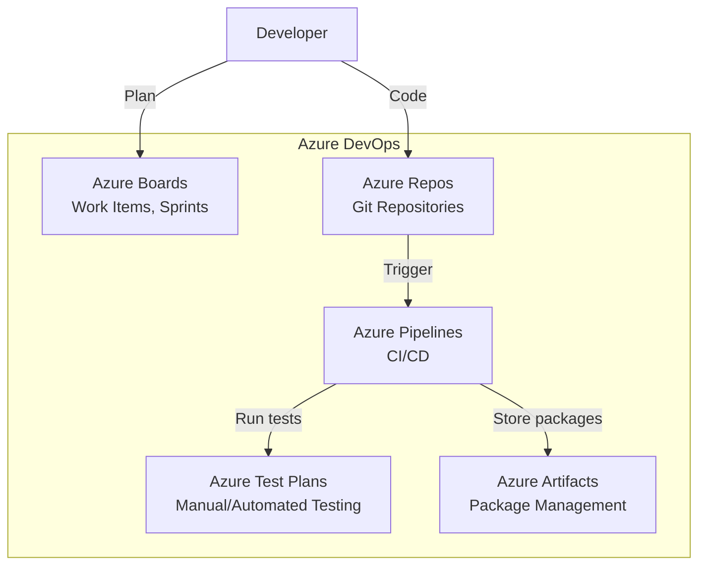
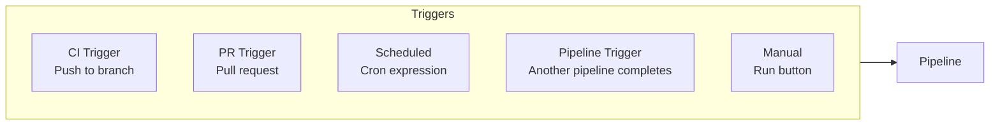
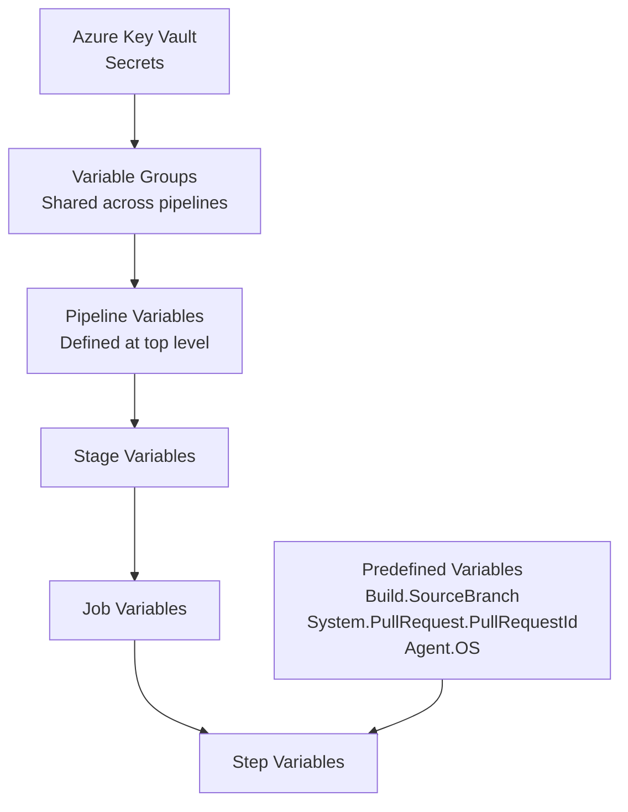
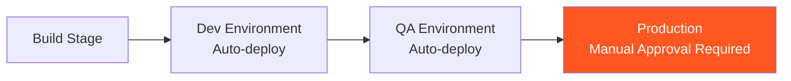

# Azure DevOps - LEARNING MATERIAL

---

## Azure DevOps Services Overview



## Azure Pipeline YAML Structure

```yaml
# azure-pipelines.yml
trigger:
  branches:
    include: [main, develop]
  paths:
    include: [src/*, tests/*]
    exclude: [docs/*]

pr:
  branches:
    include: [main]

pool:
  vmImage: 'ubuntu-latest'    # Microsoft-hosted agent
  # OR
  # name: 'self-hosted-pool'  # Self-hosted agent

variables:
  - group: prod-secrets       # Variable group (linked to Key Vault)
  - name: buildConfiguration
    value: 'Release'

stages:
- stage: Build
  displayName: 'Build & Test'
  jobs:
  - job: BuildJob
    steps:
    - checkout: self
      fetchDepth: 0

    - task: UseDotNet@2
      inputs:
        version: '8.x'

    - script: |
        dotnet build --configuration $(buildConfiguration)
        dotnet test --logger trx
      displayName: 'Build and Test'

    - task: PublishTestResults@2
      inputs:
        testResultsFormat: 'VSTest'
        testResultsFiles: '**/*.trx'

    - task: PublishBuildArtifacts@1
      inputs:
        PathtoPublish: '$(Build.ArtifactStagingDirectory)'
        ArtifactName: 'drop'

- stage: Deploy
  dependsOn: Build
  condition: and(succeeded(), eq(variables['Build.SourceBranch'], 'refs/heads/main'))
  jobs:
  - deployment: DeployProd
    environment: 'production'    # Has approval gates
    strategy:
      runOnce:
        deploy:
          steps:
          - download: current
            artifact: drop
          - task: AzureWebApp@1
            inputs:
              azureSubscription: 'prod-connection'
              appName: 'myapp-prod'
```

## Pipeline Triggers



## Variables Scope



## Templates (DRY)

```yaml
# templates/build-template.yml
parameters:
  - name: project
    type: string
  - name: configuration
    type: string
    default: 'Release'

steps:
- script: dotnet build ${{ parameters.project }} -c ${{ parameters.configuration }}
  displayName: 'Build ${{ parameters.project }}'
- script: dotnet test ${{ parameters.project }}
  displayName: 'Test ${{ parameters.project }}'
```

```yaml
# azure-pipelines.yml - using template
stages:
- stage: Build
  jobs:
  - job: BuildAll
    steps:
    - template: templates/build-template.yml
      parameters:
        project: src/MyApp.sln
```

## Environments & Approvals



## Self-Hosted vs Microsoft-Hosted Agents

| Aspect | Microsoft-Hosted | Self-Hosted |
|---|---|---|
| Setup | Zero config | Install agent yourself |
| Cost | Free minutes (limited) | Your infrastructure |
| Customization | Limited | Full control |
| Clean state | Fresh VM each run | Persists between runs |
| Network | Public internet | Inside your network |
| Speed | Slower (VM spin-up) | Faster (pre-warmed) |
| Use case | Standard builds | Custom tools, private networks |
