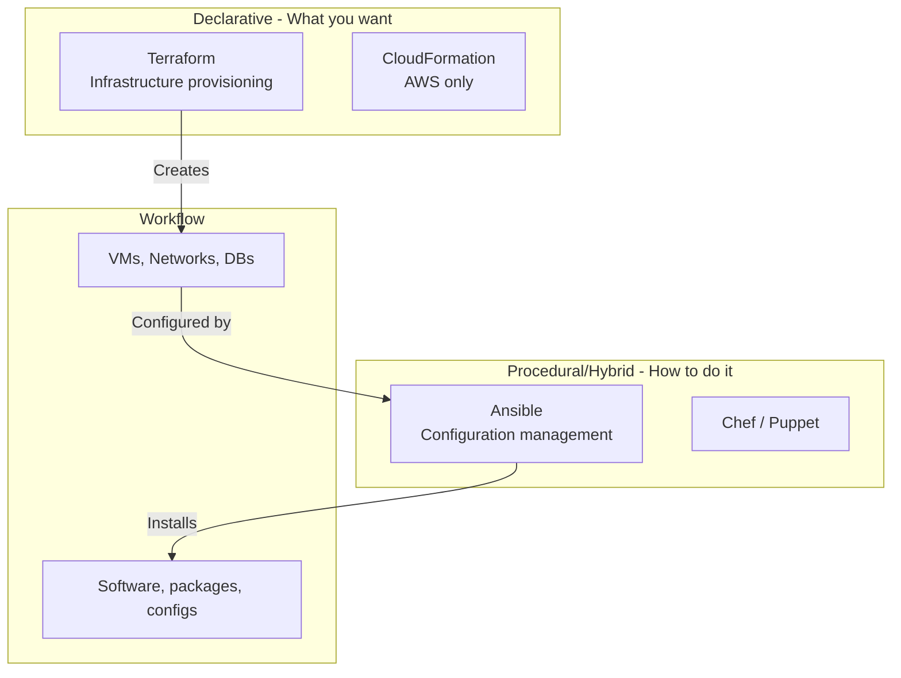
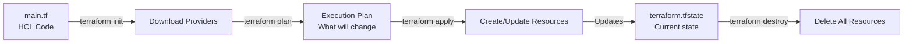
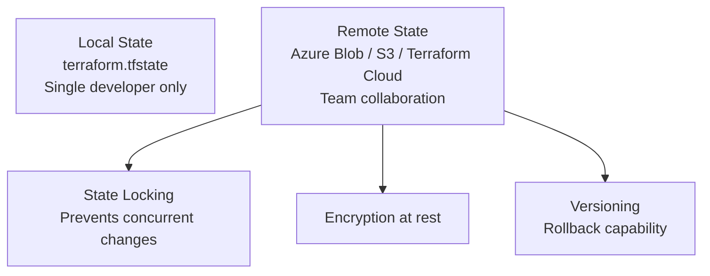
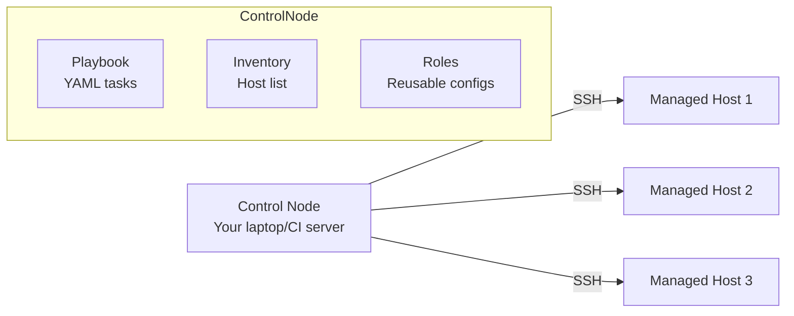

# IaC - Terraform & Ansible - LEARNING MATERIAL

---

## IaC Overview



## Terraform

### How Terraform Works



### Terraform File Structure
```
project/
├── main.tf             # Primary resources
├── variables.tf        # Input variable definitions
├── outputs.tf          # Output values
├── providers.tf        # Provider configuration
├── terraform.tfvars    # Variable values (don't commit secrets!)
├── backend.tf          # Remote state config
└── modules/
    └── vpc/
        ├── main.tf
        ├── variables.tf
        └── outputs.tf
```

### Complete Terraform Example
```hcl
# providers.tf
terraform {
  required_version = ">= 1.5"
  required_providers {
    azurerm = {
      source  = "hashicorp/azurerm"
      version = "~> 3.0"
    }
  }
  backend "azurerm" {
    resource_group_name  = "terraform-state"
    storage_account_name = "tfstate12345"
    container_name       = "state"
    key                  = "prod.tfstate"
  }
}

provider "azurerm" {
  features {}
}

# variables.tf
variable "environment" {
  type        = string
  description = "Environment name"
  default     = "dev"
  validation {
    condition     = contains(["dev", "staging", "prod"], var.environment)
    error_message = "Must be dev, staging, or prod."
  }
}
variable "location" {
  type    = string
  default = "East US"
}

# main.tf
resource "azurerm_resource_group" "main" {
  name     = "rg-myapp-${var.environment}"
  location = var.location
  tags = {
    environment = var.environment
    managed_by  = "terraform"
  }
}

resource "azurerm_kubernetes_cluster" "aks" {
  name                = "aks-${var.environment}"
  location            = azurerm_resource_group.main.location
  resource_group_name = azurerm_resource_group.main.name
  dns_prefix          = "myapp-${var.environment}"

  default_node_pool {
    name       = "default"
    node_count = var.environment == "prod" ? 3 : 1
    vm_size    = "Standard_DS2_v2"
  }

  identity {
    type = "SystemAssigned"
  }
}

# outputs.tf
output "kube_config" {
  value     = azurerm_kubernetes_cluster.aks.kube_config_raw
  sensitive = true
}
```

### Terraform State



### Key Terraform Commands
```bash
terraform init          # Download providers, setup backend
terraform plan          # Preview changes
terraform apply         # Apply changes
terraform destroy       # Delete everything
terraform fmt           # Format code
terraform validate      # Check syntax
terraform state list    # List resources in state
terraform state show    # Show resource details
terraform import        # Import existing resource
terraform workspace     # Manage workspaces (environments)
```

---

## Ansible

### How Ansible Works



**Key difference from Terraform:** Ansible is **agentless** - connects via SSH, no software to install on targets.

### Ansible Playbook Example
```yaml
# deploy.yml
---
- name: Deploy web application
  hosts: webservers
  become: yes                    # sudo
  vars:
    app_version: "1.2.3"
    app_dir: "/opt/myapp"

  tasks:
  - name: Install dependencies
    apt:
      name:
        - nginx
        - python3-pip
      state: present
      update_cache: yes

  - name: Create app directory
    file:
      path: "{{ app_dir }}"
      state: directory
      owner: www-data
      mode: '0755'

  - name: Copy application config
    template:
      src: templates/config.j2
      dest: "{{ app_dir }}/config.yml"
    notify: restart app            # Trigger handler

  - name: Start nginx
    service:
      name: nginx
      state: started
      enabled: yes

  handlers:
  - name: restart app
    service:
      name: myapp
      state: restarted
```

### Inventory File
```ini
# inventory.ini
[webservers]
web1.example.com ansible_user=deploy
web2.example.com ansible_user=deploy

[dbservers]
db1.example.com ansible_user=admin

[production:children]
webservers
dbservers

[production:vars]
ansible_ssh_private_key_file=~/.ssh/prod_key
```

### Ansible vs Terraform

| Aspect | Terraform | Ansible |
|---|---|---|
| Purpose | Provision infrastructure | Configure systems |
| Approach | Declarative only | Procedural + Declarative modules |
| State | Maintains state file | Stateless (checks current state) |
| Agent | No agent (API calls) | No agent (SSH) |
| Idempotent | Yes (by design) | Yes (if using modules correctly) |
| Best for | Cloud resources, networking | Software install, config, deployment |
| Language | HCL | YAML + Jinja2 |
