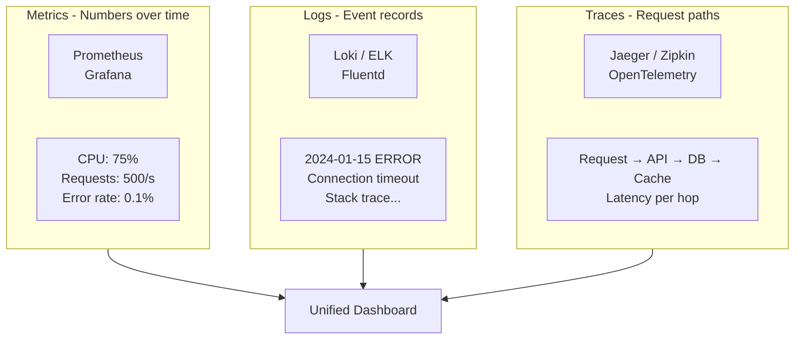
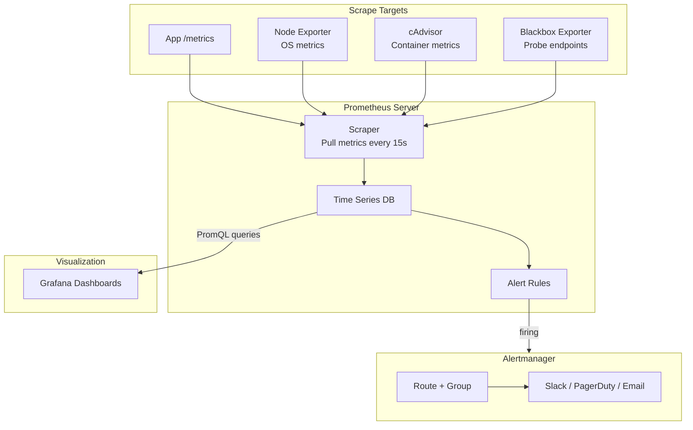

# Monitoring & Observability - LEARNING MATERIAL

---

## Three Pillars of Observability



## Prometheus Architecture



## Metric Types

| Type | Description | Example | PromQL |
|---|---|---|---|
| **Counter** | Only increases (resets on restart) | Total requests | `rate(http_requests_total[5m])` |
| **Gauge** | Goes up and down | Current temperature, memory | `node_memory_AvailableBytes` |
| **Histogram** | Distribution of values in buckets | Request latency | `histogram_quantile(0.95, rate(http_request_duration_seconds_bucket[5m]))` |
| **Summary** | Pre-calculated quantiles | Request latency | `http_request_duration_seconds{quantile="0.95"}` |

## Key PromQL Queries
```promql
# Request rate per second (last 5 minutes)
rate(http_requests_total[5m])

# Error rate percentage
sum(rate(http_requests_total{status=~"5.."}[5m])) / sum(rate(http_requests_total[5m])) * 100

# 95th percentile latency
histogram_quantile(0.95, sum(rate(http_request_duration_seconds_bucket[5m])) by (le))

# CPU usage per pod
sum(rate(container_cpu_usage_seconds_total[5m])) by (pod)

# Memory usage percentage
(node_memory_MemTotal_bytes - node_memory_MemAvailable_bytes) / node_memory_MemTotal_bytes * 100

# Disk usage
(node_filesystem_size_bytes - node_filesystem_avail_bytes) / node_filesystem_size_bytes * 100
```

## Alert Rule Example
```yaml
groups:
- name: app-alerts
  rules:
  - alert: HighErrorRate
    expr: sum(rate(http_requests_total{status=~"5.."}[5m])) / sum(rate(http_requests_total[5m])) > 0.05
    for: 5m
    labels:
      severity: critical
    annotations:
      summary: "Error rate above 5% for 5 minutes"

  - alert: HighCPU
    expr: sum(rate(container_cpu_usage_seconds_total[5m])) by (pod) > 0.8
    for: 10m
    labels:
      severity: warning
```

## Four Golden Signals

| Signal | What | Metric |
|---|---|---|
| **Latency** | Time to serve a request | p50, p95, p99 response time |
| **Traffic** | Demand on your system | Requests/second |
| **Errors** | Failed requests | 5xx rate |
| **Saturation** | How full your system is | CPU/memory/disk usage |
