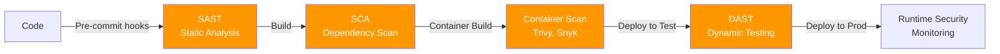
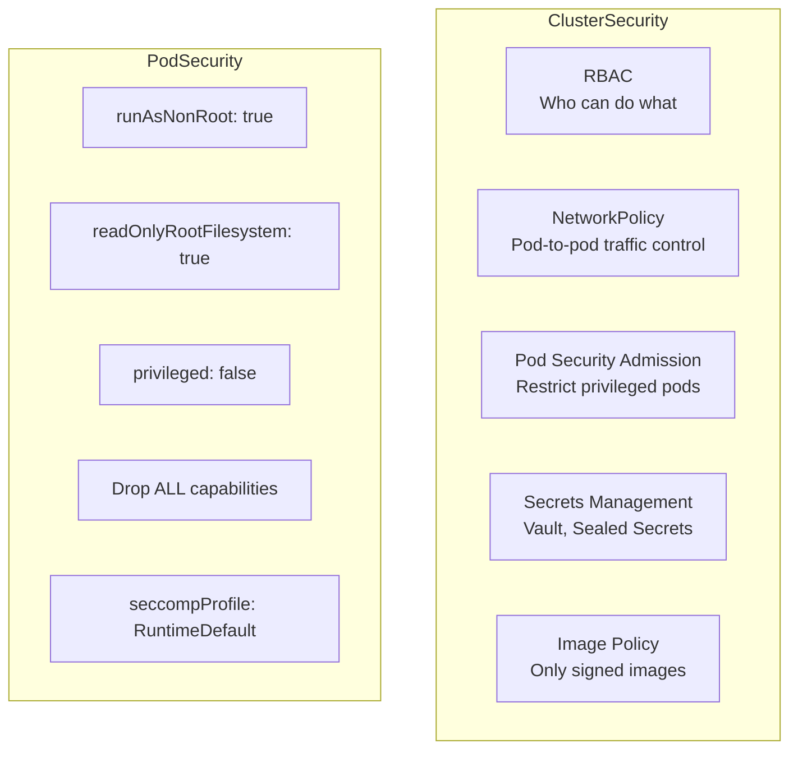
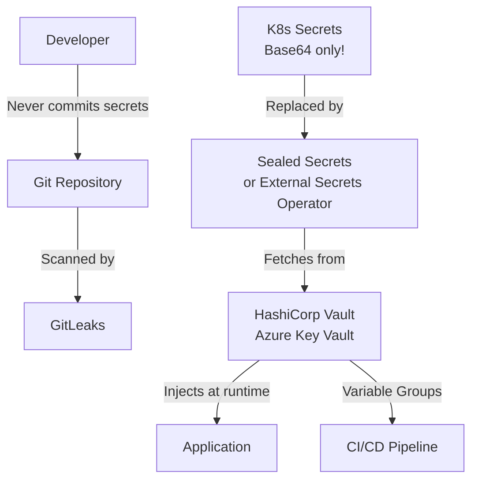

# DevSecOps - LEARNING MATERIAL

---

## DevSecOps Pipeline



## Security Scanning Types

| Type | What | When | Tools |
|---|---|---|---|
| **SAST** | Analyzes source code for vulnerabilities | During build | SonarQube, Semgrep, CodeQL |
| **SCA** | Checks dependencies for known CVEs | During build | Snyk, OWASP Dependency-Check, Dependabot |
| **Container Scan** | Scans container images | After build | Trivy, Aqua, Prisma Cloud |
| **DAST** | Tests running application | After deploy | OWASP ZAP, Burp Suite |
| **IaC Scan** | Scans Terraform/K8s for misconfig | During build | Checkov, tfsec, kube-bench |
| **Secret Scan** | Finds hardcoded secrets | Pre-commit/build | GitLeaks, detect-secrets, truffleHog |

## OWASP Top 10 (2021)

| # | Vulnerability | Prevention |
|---|---|---|
| A01 | Broken Access Control | RBAC, least privilege, deny by default |
| A02 | Cryptographic Failures | TLS everywhere, strong encryption, no hardcoded secrets |
| A03 | Injection (SQL, XSS, etc.) | Input validation, parameterized queries, CSP |
| A04 | Insecure Design | Threat modeling, security requirements |
| A05 | Security Misconfiguration | Hardened defaults, no defaults in prod, IaC scanning |
| A06 | Vulnerable Components | SCA scanning, keep dependencies updated |
| A07 | Auth Failures | MFA, strong passwords, rate limiting |
| A08 | Software Integrity Failures | Signed artifacts, verified CI/CD, SBOM |
| A09 | Logging Failures | Security event logging, tamper-proof logs |
| A10 | SSRF | Input validation, deny-by-default firewall |

## Kubernetes Security



### Security Context Example
```yaml
apiVersion: v1
kind: Pod
spec:
  securityContext:
    runAsNonRoot: true
    runAsUser: 1000
    fsGroup: 2000
  containers:
  - name: app
    image: myapp:v1
    securityContext:
      allowPrivilegeEscalation: false
      readOnlyRootFilesystem: true
      capabilities:
        drop: ["ALL"]
```

## Secrets Management


