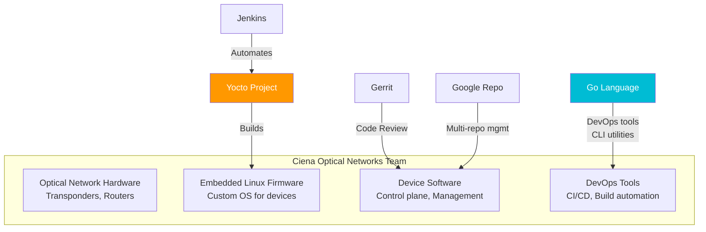
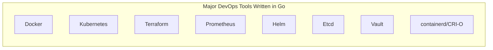
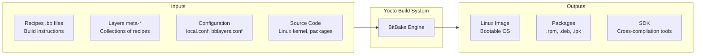
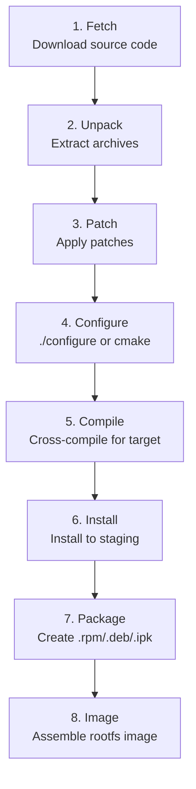
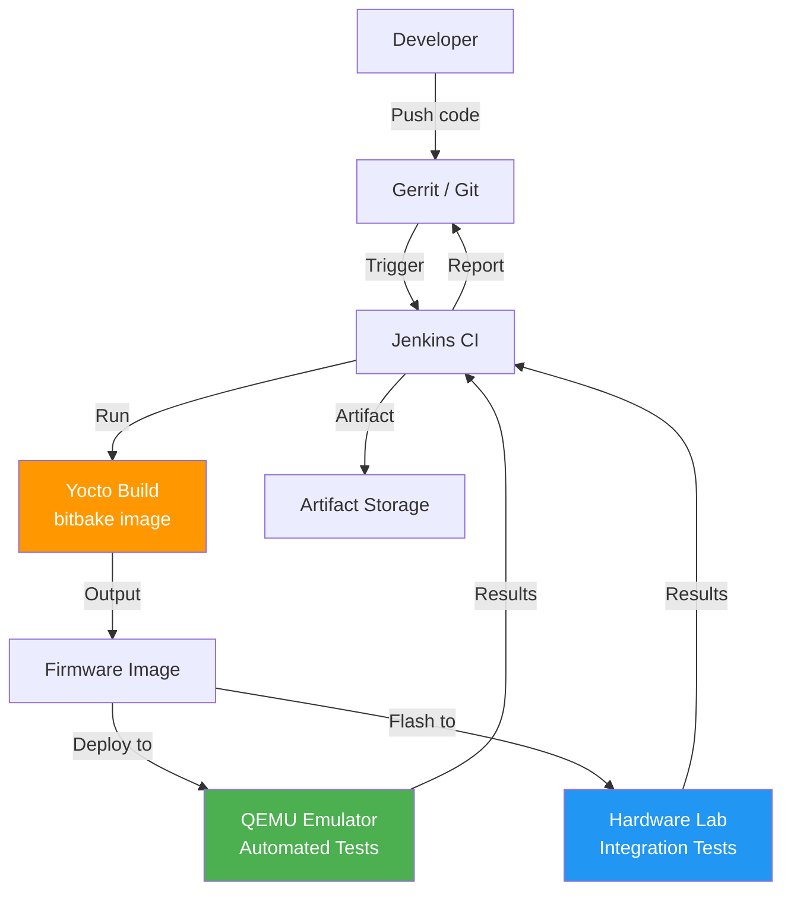

# Go, Yocto & Embedded DevOps - LEARNING MATERIAL (YOUR CRITICAL GAP)

---

## Why Ciena Cares About These



---

## Go (Golang) Essentials

### Why Go Matters for DevOps


### Go Basics
```go
package main

import (
    "fmt"
    "os"
    "os/exec"
    "log"
)

func main() {
    // Variables
    name := "Vaibhav"
    var age int = 30

    // Print
    fmt.Printf("Name: %s, Age: %d\n", name, age)

    // If/else
    if age > 25 {
        fmt.Println("Experienced")
    }

    // For loop (only loop in Go)
    for i := 0; i < 5; i++ {
        fmt.Println(i)
    }

    // Slice (dynamic array)
    fruits := []string{"apple", "banana", "cherry"}
    for _, fruit := range fruits {
        fmt.Println(fruit)
    }

    // Map
    config := map[string]string{
        "host": "localhost",
        "port": "8080",
    }
    fmt.Println(config["host"])

    // Error handling (no try/catch!)
    data, err := os.ReadFile("config.txt")
    if err != nil {
        log.Fatalf("Failed to read: %v", err)
    }
    fmt.Println(string(data))

    // Run shell command
    cmd := exec.Command("ls", "-la")
    output, err := cmd.Output()
    if err != nil {
        log.Fatal(err)
    }
    fmt.Println(string(output))
}
```

### Go Key Concepts

| Concept | Description |
|---|---|
| **Goroutines** | Lightweight threads: `go myFunction()` |
| **Channels** | Communication between goroutines: `ch := make(chan string)` |
| **Interfaces** | Implicit (no `implements` keyword) |
| **Error handling** | Return error as second value, check with `if err != nil` |
| **Modules** | `go mod init`, `go.mod` manages dependencies |
| **Cross-compilation** | `GOOS=linux GOARCH=arm64 go build` → binary for target HW |
| **Static binary** | Single file, no dependencies → great for containers |
| **Testing** | `go test ./...` with `_test.go` files |

---

## Yocto Project Deep Dive

### What is Yocto?



### Yocto Build Workflow



### Key Yocto Terminology

| Term | What It Is | Example |
|---|---|---|
| **Recipe (.bb)** | Build instructions for ONE package | `nginx_1.24.bb` |
| **Layer (meta-*)** | Collection of related recipes | `meta-ciena`, `meta-networking` |
| **BitBake** | The build engine (like Make) | `bitbake core-image-minimal` |
| **Poky** | Reference distribution (starting point) | Includes OE-Core + BitBake |
| **OpenEmbedded** | Build framework Yocto is based on | OE-Core layer |
| **BSP** | Board Support Package (HW-specific) | `meta-intel`, `meta-raspberrypi` |
| **Image** | Final bootable output | `core-image-minimal`, `core-image-full` |
| **Machine** | Target hardware definition | `MACHINE = "qemuarm64"` |
| **Distro** | Distribution policy | `DISTRO = "poky"` |
| **sstate-cache** | Shared state cache (speeds rebuilds) | Cached build outputs |
| **.bbappend** | Modify existing recipe without forking | `nginx_%.bbappend` |

### Example Recipe (.bb file)
```bash
# meta-mycompany/recipes-apps/myapp/myapp_1.0.bb
SUMMARY = "My custom application"
LICENSE = "MIT"
LIC_FILES_CHKSUM = "file://LICENSE;md5=abc123"

SRC_URI = "git://github.com/myco/myapp.git;branch=main"
SRCREV = "abc123def456"

S = "${WORKDIR}/git"

inherit cmake    # or: inherit autotools, setuptools3

do_install() {
    install -d ${D}${bindir}
    install -m 0755 ${B}/myapp ${D}${bindir}/myapp
}
```

### Yocto Directory Structure
```
poky/
├── bitbake/                    # BitBake build tool
├── meta/                       # OE-Core layer
├── meta-poky/                  # Poky distro layer
├── meta-yocto-bsp/            # Yocto BSP layer
└── build/                      # Build directory
    ├── conf/
    │   ├── local.conf          # Machine, distro, parallel settings
    │   └── bblayers.conf       # Which layers to include
    ├── tmp/
    │   ├── deploy/images/      # OUTPUT: final images here
    │   ├── work/               # Per-recipe build directories
    │   └── sstate-cache/       # Cached build outputs
    └── downloads/              # Downloaded source tarballs
```

### Key Configuration Files

**local.conf:**
```bash
MACHINE = "qemuarm64"          # Target hardware
DISTRO = "poky"                # Distribution
PARALLEL_MAKE = "-j 8"         # Parallel compilation
BB_NUMBER_THREADS = "8"        # Parallel BitBake tasks
DL_DIR = "/opt/yocto/downloads"       # Shared downloads
SSTATE_DIR = "/opt/yocto/sstate-cache" # Shared build cache
```

**bblayers.conf:**
```bash
BBLAYERS = " \
    /path/to/poky/meta \
    /path/to/poky/meta-poky \
    /path/to/meta-openembedded/meta-oe \
    /path/to/meta-ciena \
"
```

### Common Yocto Commands
```bash
source oe-init-build-env build/         # Setup environment
bitbake core-image-minimal              # Build minimal image
bitbake myapp                           # Build single recipe
bitbake -c menuconfig virtual/kernel    # Configure kernel
bitbake -c devshell myapp               # Open dev shell
bitbake -e myapp | grep ^SRC_URI       # Show recipe variables
bitbake-layers show-layers              # List active layers
bitbake-layers show-recipes "*nginx*"   # Find recipes
```

---

## Embedded CI/CD Architecture



### Embedded vs Web CI/CD

| Aspect | Web/Cloud | Embedded |
|---|---|---|
| Build time | Minutes | Hours (full Yocto build) |
| Test target | Containers/VMs | Real hardware / emulators |
| Artifact | Docker image | Firmware binary / OS image |
| Deploy | `kubectl apply` | Flash to device / OTA update |
| Cross-compile | Usually not needed | Always needed |
| Build cache | Docker layers, npm cache | sstate-cache, downloads cache |
| Frequency | Multiple/day | Daily/nightly builds |
| Toolchain | Standard (Node, Python, Java) | Custom cross-toolchain |

### QEMU for CI Testing
```bash
# Run Yocto image in QEMU
runqemu qemuarm64 nographic

# Or directly
qemu-system-aarch64 \
    -machine virt \
    -kernel Image \
    -drive file=rootfs.ext4,format=raw \
    -nographic \
    -append "root=/dev/vda console=ttyAMA0"
```

---

## How to Talk About Yocto in Interview (Even Without Experience)

**Frame it positively:**
> "I haven't worked directly with Yocto, but I understand it conceptually — it's a build system for creating custom embedded Linux distributions using BitBake and recipes. My CI/CD and Jenkins experience translates directly: automating builds, managing caching (sstate-cache is analogous to Docker layer caching), parallelizing work, and integrating with code review systems like Gerrit. I'm confident I can ramp up quickly on the specifics."

**Draw parallels:**
| Your Experience | Yocto Equivalent |
|---|---|
| Docker build | `bitbake image` |
| Dockerfile | Recipe (.bb file) |
| Docker layer cache | sstate-cache |
| Docker registry | Artifact server for images |
| Azure Pipeline YAML | Jenkinsfile for Yocto builds |
| `npm install` / `pip install` | BitBake fetch + compile |
| Multi-stage build | Yocto build stages (fetch→compile→package→image) |
