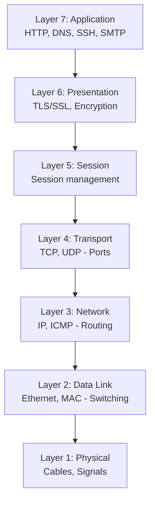
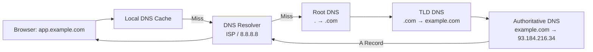
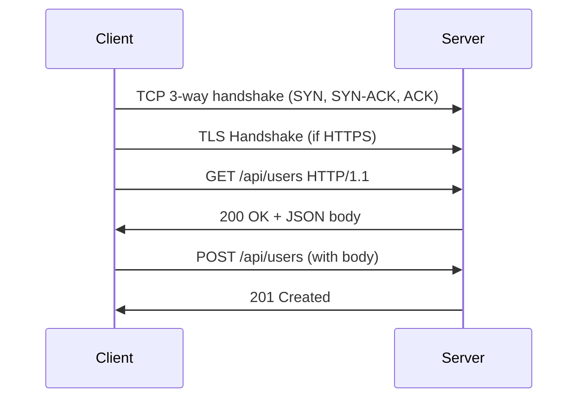
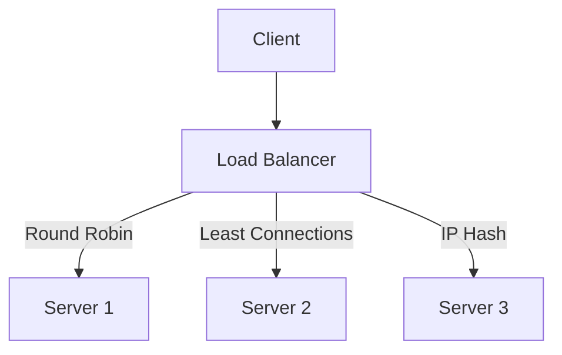
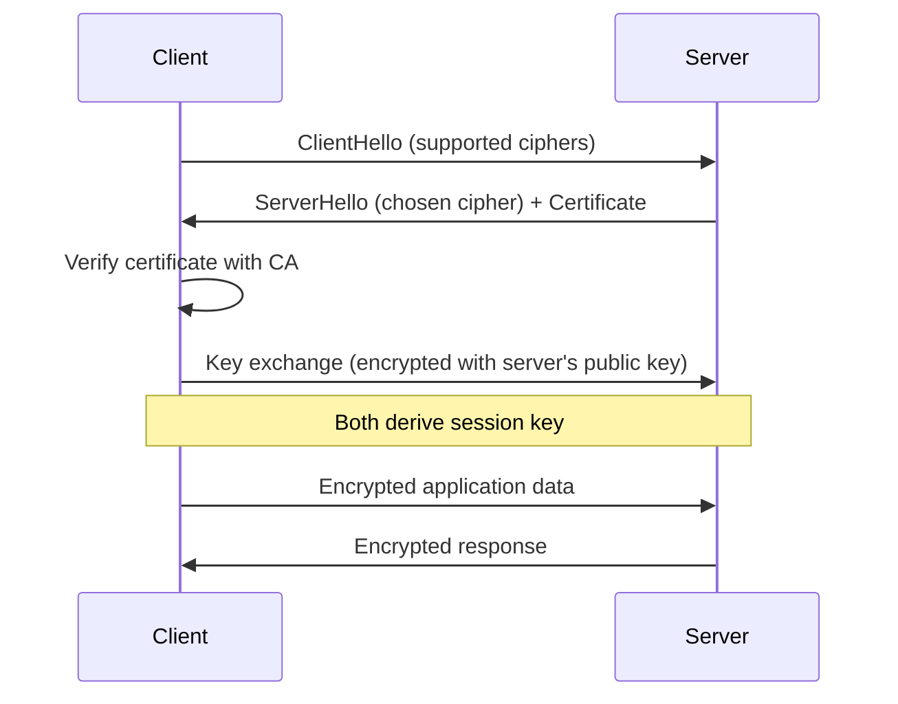
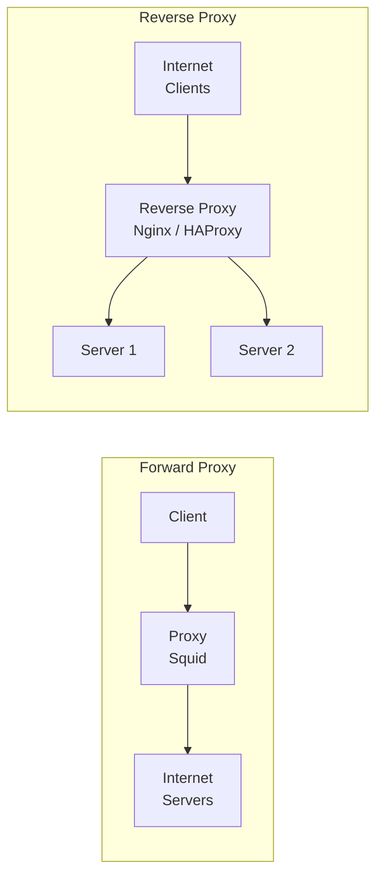

# Networking - LEARNING MATERIAL

---

## OSI Model



## TCP vs UDP

| Feature | TCP | UDP |
|---|---|---|
| Connection | Connection-oriented (3-way handshake) | Connectionless |
| Reliability | Guaranteed delivery, ordering | Best effort |
| Speed | Slower (overhead) | Faster |
| Use cases | HTTP, SSH, FTP, DB | DNS, streaming, VoIP, gaming |

## DNS Resolution



### DNS Record Types

| Record | Purpose | Example |
|---|---|---|
| **A** | Domain → IPv4 | `app.example.com → 93.184.216.34` |
| **AAAA** | Domain → IPv6 | `app.example.com → 2606:2800:...` |
| **CNAME** | Alias → another domain | `www.example.com → app.example.com` |
| **MX** | Mail server | `example.com → mail.example.com` |
| **NS** | Nameserver | `example.com → ns1.example.com` |
| **TXT** | Arbitrary text | SPF, DKIM, domain verification |
| **SRV** | Service discovery | `_http._tcp.example.com` |

## HTTP/HTTPS



### HTTP Status Codes

| Code | Meaning | Common Scenario |
|---|---|---|
| **200** | OK | Successful GET |
| **201** | Created | Successful POST |
| **301** | Moved Permanently | URL redirect (cached) |
| **302** | Found | Temporary redirect |
| **400** | Bad Request | Invalid input |
| **401** | Unauthorized | Missing/invalid auth |
| **403** | Forbidden | No permission |
| **404** | Not Found | Wrong URL |
| **500** | Internal Server Error | Server bug |
| **502** | Bad Gateway | Upstream server down |
| **503** | Service Unavailable | Server overloaded |
| **504** | Gateway Timeout | Upstream timed out |

## Essential Network Commands

```bash
# DNS lookup
nslookup example.com
dig example.com A
dig +short example.com

# Connectivity
ping -c 4 example.com              # ICMP ping
traceroute example.com              # Route path (tracert on Windows)
curl -v https://api.example.com     # HTTP request with details
curl -I https://example.com         # Headers only

# Ports and connections
ss -tlnp                            # Listening ports (Linux)
netstat -an | grep LISTEN           # Listening ports
nc -zv host 80                      # Test port connectivity

# Network config
ip addr show                        # Show IP addresses
ip route show                       # Show routing table
cat /etc/resolv.conf                # DNS config
```

## Load Balancing



| Algorithm | How | Use Case |
|---|---|---|
| Round Robin | Sequential distribution | Equal servers |
| Least Connections | Send to least busy | Varying request times |
| IP Hash | Same client → same server | Session affinity |
| Weighted | More traffic to stronger servers | Mixed hardware |

## TLS/SSL



## Proxy vs Reverse Proxy



| Type | Sits in front of | Purpose |
|---|---|---|
| Forward Proxy | Clients | Anonymity, caching, filtering |
| Reverse Proxy | Servers | Load balancing, SSL termination, caching |
