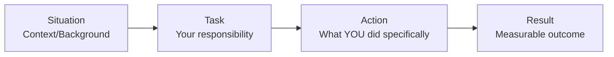
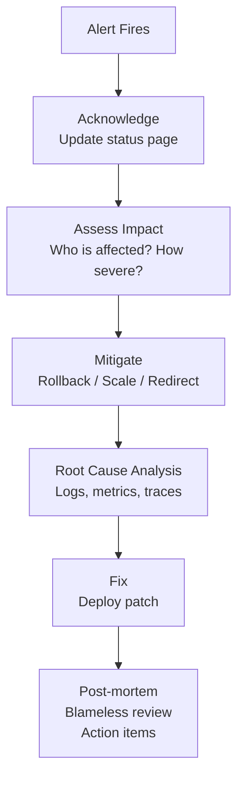
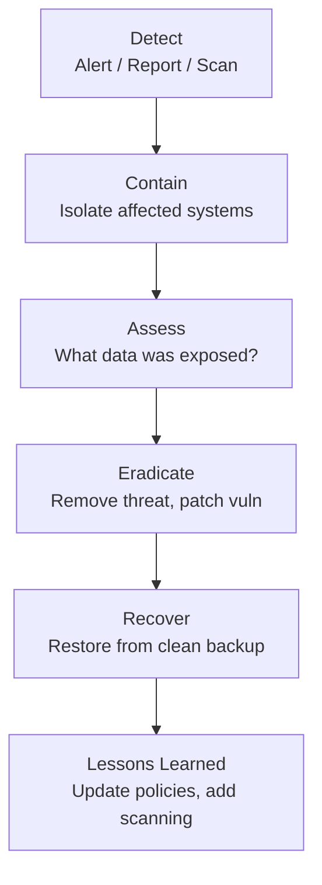

# Scenarios & Behavioral - LEARNING MATERIAL

---

## STAR Method for Behavioral Questions



**Example:**
- **S**: Our CI pipeline took 45 minutes, blocking developer productivity
- **T**: I was tasked with optimizing the pipeline
- **A**: Analyzed stages, added parallel jobs, implemented Docker layer caching, moved to self-hosted agents
- **R**: Reduced build time to 12 minutes (73% reduction), increased developer deployments from 2/day to 8/day

---

## Common Scenario Categories

### 1. Production Incident Response



**When asked "How would you handle a production outage?":**
1. **Acknowledge** - Don't panic. Communicate with stakeholders
2. **Assess** - What's broken? What's the blast radius?
3. **Mitigate** - Rollback to last known good state
4. **Diagnose** - Check monitoring dashboards, logs, recent changes
5. **Fix** - Deploy the fix
6. **Post-mortem** - Document what happened, add monitoring/alerts to prevent recurrence

### 2. Pipeline Optimization

**Template answer structure:**
```
1. Measure current state (what's slow?)
2. Identify bottlenecks (build time? test time? deploy?)
3. Apply specific optimizations:
   - Caching (Docker layers, npm/pip cache, sstate-cache)
   - Parallelization (parallel stages, test splitting)
   - Incremental builds (only rebuild what changed)
   - Agent optimization (self-hosted, spot instances)
4. Measure improvement with numbers
```

### 3. Security Breach / Vulnerability



---

## Key Behavioral Themes for Ciena

### Collaboration / Teamwork
> "At my current company, I worked closely with developers across multiple teams on shared Azure DevOps pipelines. When teams had conflicting requirements, I created templated pipeline definitions that could be customized per team while maintaining our standards."

### Learning New Technologies
> "When I joined current company, I had no Azure DevOps experience. I ramped up by reading docs, building proof-of-concepts, and within 3 months I was the go-to person for pipeline questions in my team."

### Handling Ambiguity
> "In my current role, requirements often change. I've learned to build flexible, modular solutions - like using YAML templates in Azure Pipelines - so changes don't require rebuilding everything."

### Conflict Resolution
> "When a developer wanted to skip security scanning to meet a deadline, I proposed a compromise: run critical scans as blocking gates but move non-critical scans to a parallel non-blocking stage. This maintained security without slowing the team."

---

## Why Ciena? (Have a prepared answer)

Key points to weave in:
1. **Optical networking** is backbone of internet infrastructure - meaningful work
2. **Embedded systems** - exciting to work closer to hardware than typical cloud DevOps
3. **Growth opportunity** - learning Yocto, Go, embedded CI/CD expands your skillset
4. **Your current skills transfer** - CI/CD, Docker, K8s, Azure Pipelines are universal
5. **Specific to Ciena** - mention their WaveLogic technology, Blue Planet platform, or adaptive networking

---

## Questions to Ask Interviewer

1. "What does a typical sprint look like for the embedded DevOps team?"
2. "What's the biggest CI/CD challenge the team is currently facing?"
3. "How does the team handle long Yocto build times in CI?"
4. "What's the split between Jenkins pipeline work vs infrastructure automation?"
5. "What does the onboarding and ramp-up process look like for a new team member?"
